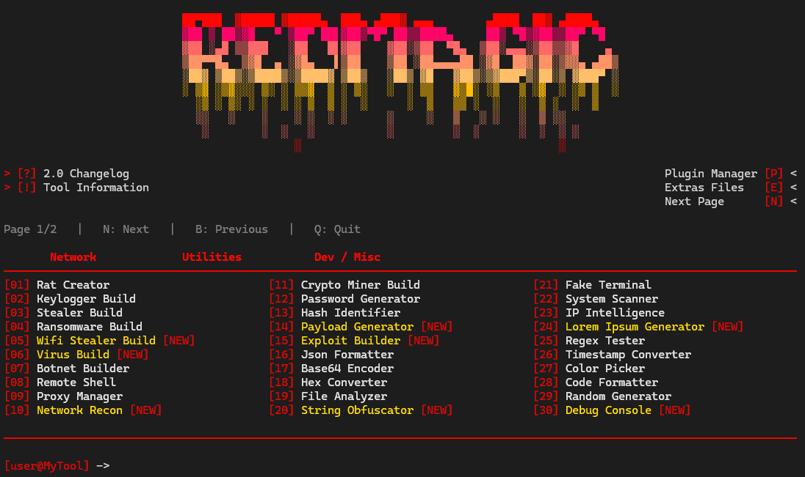

<p align="center">
  
</p>

<h1 align="center">⚡ RedMagic</h1>

<p align="center">
  <strong>A modular Python multitool built for learning, experimentation and future expansion.</strong>
</p>

<p align="center">


</p>

<p align="center">

⭐ If you like RedMagic, consider giving the repository a star!

</p>

---

## 🖥️ About

**RedMagic** is an interactive command-line multitool written in Python, designed around a large modular menu.

The project aims to provide a single, easy-to-use CLI containing different utilities for developers, system administration, networking, data processing and security research.

RedMagic is designed to become a **clean, modular and extensible Python toolbox** where new modules can be added without rewriting the entire application.

### 🔧 Main categories

* 🌐 Network & IP utilities
* 🛠️ General-purpose utilities
* 🔐 Hashing, encoding & cryptography-related helpers
* 📁 File and data utilities
* 🧪 Developer and testing utilities
* 🎲 Generators and miscellaneous tools
* 🖥️ System utilities
* 🔌 Future plugin system

> **Important:** RedMagic is currently a work in progress. Some menu entries are prototypes, placeholders or unfinished modules and should not be considered production-ready.

---

## ✨ Features

### 🎨 Interactive CLI

RedMagic provides an interactive terminal interface featuring:

* ⚡ Custom ASCII branding
* 📂 Categorized modules
* ⌨️ Keyboard navigation
* 📄 Multi-page menus
* 📜 Changelog / information screens
* 🔌 Plugin manager entry
* ⚙️ Extras and configuration sections
* 🧩 Modular architecture

Example:

```text
[RedMagic] -> 21

Choose a module and run it directly from the terminal.
```

---

## 📦 Current Modules

The current interface contains modules such as:

|  # | Module                | Category                      | Status         |
| -: | --------------------- | ----------------------------- | -------------- |
| 01 | Rat Creator           | Security research / prototype | 🧪 Prototype   |
| 02 | Keylogger Build       | Security research / prototype | 🧪 Prototype   |
| 03 | Stealer Build         | Security research / prototype | 🧪 Prototype   |
| 04 | Ransomware Build      | Security research / prototype | 🧪 Prototype   |
| 05 | WiFi Stealer Build    | Security research / prototype | 🧪 Prototype   |
| 06 | Virus Build           | Security research / prototype | 🧪 Prototype   |
| 07 | Botnet Builder        | Security research / prototype | 🧪 Prototype   |
| 08 | Remote Shell          | Administration / research     | 🧪 Prototype   |
| 09 | Proxy Manager         | Network                       | 🚧 Development |
| 10 | Network Recon         | Network                       | 🚧 Development |
| 11 | Crypto Miner Build    | Research / prototype          | 🧪 Prototype   |
| 12 | Password Generator    | Utility                       | ✅ Functional   |
| 13 | Hash Identifier       | Utility                       | ✅ Functional   |
| 14 | Payload Generator     | Security research / prototype | 🧪 Prototype   |
| 15 | Exploit Builder       | Security research / prototype | 🧪 Prototype   |
| 16 | JSON Formatter        | Developer                     | ✅ Functional   |
| 17 | Base64 Encoder        | Developer                     | ✅ Functional   |
| 18 | Hex Converter         | Developer                     | ✅ Functional   |
| 19 | File Analyzer         | Utility                       | 🚧 Development |
| 20 | String Obfuscator     | Developer / research          | 🧪 Prototype   |
| 21 | Fake Terminal         | Demo                          | 🧪 Prototype   |
| 22 | System Scanner        | System                        | 🚧 Development |
| 23 | IP Intelligence       | Network                       | 🚧 Development |
| 24 | Lorem Ipsum Generator | Utility                       | ✅ Functional   |
| 25 | Regex Tester          | Developer                     | ✅ Functional   |
| 26 | Timestamp Converter   | Developer                     | ✅ Functional   |
| 27 | Color Picker          | Utility                       | 🚧 Development |
| 28 | Code Formatter        | Developer                     | 🚧 Development |
| 29 | Random Generator      | Utility                       | ✅ Functional   |
| 30 | Debug Console         | Developer                     | 🧪 Prototype   |

More modules are planned for future releases.

### Status legend

* ✅ **Functional** — currently usable
* 🚧 **Development** — partially implemented / being improved
* 🧪 **Prototype** — experimental or demonstration code
* 📋 **Planned** — not implemented yet

**The README deliberately does not claim that every menu entry is functional.**

---

## 🚀 Installation

### Requirements

* Python **3.9+**
* Git
* A terminal / command prompt

The core project is intended to rely primarily on the Python standard library.

Optional dependencies may be added as the project evolves.

### Clone

```bash
git clone https://github.com/YOUR_USERNAME/RedMagic.git
cd RedMagic
```

### Run

#### Windows

```powershell
py RedMagic.py
```

or:

```powershell
python RedMagic.py
```

#### Linux / macOS

```bash
python3 RedMagic.py
```

---

## 📸 Interface

RedMagic uses a custom terminal interface with categorized modules, navigation controls and an ASCII-style logo.

Example screenshot:

```markdown

```

You can place screenshots and GIFs inside the `assets/` directory.

Recommended structure:

```text
assets/
├── banner.png
├── menu.png
└── demo.gif
```

---

## 🧩 Architecture

RedMagic is intended to evolve from a single CLI into a modular application.

A future structure may look like:

```text
RedMagic/
├── RedMagic.py
├── README.md
├── LICENSE
├── requirements.txt
├── pyproject.toml
├── CHANGELOG.md
├── CONTRIBUTING.md
├── SECURITY.md
├── assets/
│   ├── banner.png
│   ├── menu.png
│   └── demo.gif
├── docs/
├── modules/
│   ├── network/
│   ├── crypto/
│   ├── developer/
│   ├── system/
│   └── utilities/
└── tests/
```

This makes it easier to:

* Add new modules
* Test modules independently
* Fix bugs without touching unrelated features
* Accept community contributions
* Build plugins
* Maintain multiple releases

---

## 🔌 Plugin System

A plugin manager is planned as part of RedMagic's modular architecture.

The long-term goal is to allow additional utilities to be installed without modifying the core application.

Possible future workflow:

```text
RedMagic
  │
  ├── Core
  │
  ├── Built-in modules
  │
  └── Plugins
       ├── Network plugin
       ├── Developer plugin
       └── Utility plugin
```

The plugin API is subject to change while the project is in development.

---

## 🗺️ Roadmap

### v2.x

* [x] Interactive menu
* [x] Multi-page navigation
* [x] Module categories
* [x] Basic utility modules
* [x] Changelog / information screens
* [ ] Finish incomplete modules
* [ ] Improve error handling
* [ ] Improve cross-platform compatibility
* [ ] Add automated tests
* [ ] Add configuration system
* [ ] Improve plugin manager
* [ ] Improve documentation

### Future

* [ ] Proper plugin API
* [ ] Module discovery
* [ ] Configuration file
* [ ] Better terminal rendering
* [ ] Unit tests for every stable module
* [ ] CI / automated testing
* [ ] Versioned releases
* [ ] Package distribution
* [ ] Community-contributed modules

---

## 🧪 Development Status

RedMagic is **not finished**.

The visual menu currently contains more entries than there are fully mature implementations. Some modules are demonstrations, experiments or placeholders.

If you clone the repository and something does not work, please open an issue with:

1. Operating system
2. Python version
3. Module number/name
4. Exact error message
5. Steps to reproduce

This helps development considerably.

---

## 🐛 Issues & Feature Requests

Found a bug?

Open a GitHub Issue and include enough information to reproduce it.

Have an idea?

Feature requests are welcome, especially for:

* New harmless utilities
* Developer tooling
* System administration helpers
* Network diagnostics
* Data conversion
* Testing tools
* UI/UX improvements
* Plugin ideas

---

## 🤝 Contributing

Contributions are welcome.

Before submitting a pull request:

```bash
git pull
```

Then test your changes locally.

For a new module, please try to keep it:

* Self-contained
* Documented
* Cross-platform where possible
* Easy to understand
* Covered by tests when practical
* Compatible with the existing CLI architecture

Please do not submit malware, credential theft, destructive payloads, unauthorized access tooling, or code intended to compromise systems.

---

## ⚠️ Responsible Use

RedMagic is a **research, educational and development project**.

Some security-themed entries are experimental concepts and are not intended to facilitate unauthorized access, credential theft, persistence, destructive attacks or deployment against systems without permission.

Only use security functionality on systems, accounts and networks that you own or are explicitly authorized to test.

The maintainers are not responsible for misuse of this project.

---

## 📜 License

This project is released under the **MIT License**.

See [`LICENSE`](LICENSE) for the complete license text.

---

## ⭐ Support the Project

If you like the idea behind RedMagic and want to see it grow:

### ⭐ Give the repository a star!

Every star helps the project get more visibility and motivates future updates.

You can also:

* 🐛 Report bugs
* 💡 Suggest features
* 📖 Improve documentation
* 🧩 Contribute modules
* 📢 Share the project
* 🔀 Open pull requests

---

## 📈 Project Vision

RedMagic started as a terminal menu and is evolving toward a modular Python toolbox.

The long-term objective is simple:

> **One CLI. Many useful tools. Clean architecture. Community-driven development.**

The goal is to make every stable module documented, tested and genuinely useful rather than simply filling the menu with entries.

---

## ⭐ Star History

Star the repository to follow future releases and improvements.

---

<h3 align="center">⚡ RedMagic</h3>

<p align="center">
  <strong>Built with Python 🐍</strong>
</p>

<p align="center">
  30+ modules • Modular architecture • Continuous development
</p>

<p align="center">
  ⭐ <strong>Give the repository a star for future updates!</strong>
</p>
